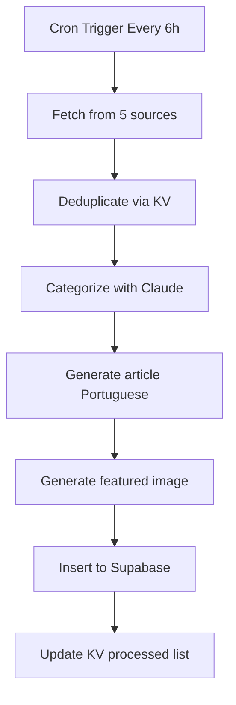

# SARAIVA.AI - Project Memory & Intelligence

**Generated**: 2026-02-24  
**Purpose**: Complete project knowledge base for AI agents and developers

---

## 📋 Project Overview

### Core Identity
- **Name**: SARAIVA.AI
- **Type**: React SPA - AI Tools Curated Library
- **Live URL**: https://saraiva.ai
- **Repository**: https://github.com/saraivabr/site_saraiva.ai.git
- **Description**: Biblioteca curada de ferramentas de IA, prompts prontos, servidores MCP e templates. Atualizada diariamente via AI automation.

### Key Metrics
- **1000+ AI resources** curated
- **50+ AI tools** tested and reviewed  
- **150+ ready-to-use prompts**
- **18+ verified MCP servers**
- Daily automatic content updates

---

## 🏗️ Technical Stack

### Frontend (React SPA)
```json
{
  "framework": "React 18.3.1",
  "language": "TypeScript 5.8.3",
  "buildTool": "Vite 5.4.19",
  "compiler": "@vitejs/plugin-react-swc 3.11.0",
  "routing": "React Router DOM 6.30.1",
  "stateManagement": "@tanstack/react-query 5.83.0",
  "styling": "Tailwind CSS 3.4.17",
  "uiComponents": "shadcn/ui (Radix UI primitives)",
  "animations": "Framer Motion 12.26.2",
  "forms": "React Hook Form 7.61.1 + Zod 3.25.76",
  "markdown": "react-markdown 10.1.0 + remark-gfm 4.0.1"
}
```

### Backend & Infrastructure
```json
{
  "database": "Supabase 2.95.3 (PostgreSQL)",
  "contentAggregation": "Cloudflare Workers",
  "aiCategorization": "Anthropic Claude API (Sonnet 4.5)",
  "imageGeneration": "Hugging Face API (FLUX.1-schnell)",
  "deduplication": "Cloudflare KV Store",
  "deployment": ["Vercel (primary)", "Netlify", "Scalingo", "Heroku"]
}
```

---

## 🗄️ Database Schema

### Table: `contents`
Main content table for tools, prompts, analyses, and thoughts.

```typescript
interface Content {
  id: string;                    // UUID (auto-generated)
  title: string;                 // SEO-optimized title
  description: string | null;    // Meta description (150-160 chars)
  body: string | null;           // Markdown article content
  category: ContentCategory;     // "prompt" | "tool" | "analysis" | "thought"
  tags: string[];                // 5-7 relevant keywords (Postgres array)
  featured: boolean;             // Show in featured sections
  published: boolean;            // Visibility flag
  created_at: string;            // Timestamp (auto)
  updated_at: string;            // Timestamp (auto)
  image_url: string | null;      // Featured image from HF API
  pricing: string | null;        // "Free" | "Freemium" | "Paid" (tools only)
  website_url: string | null;    // External tool URL
}
```

**Indexes**:
- `category` + `published` + `featured` (for homepage queries)
- `tags` (GIN index for array containment)
- `title`, `description` (for full-text search)

### Table: `mcp_servers`
MCP (Model Context Protocol) server directory.

```typescript
interface McpServer {
  id: string;
  name: string;                  // Display name
  slug: string;                  // URL-friendly identifier (unique)
  description: string | null;    // Short description
  long_description: string | null; // Detailed markdown docs
  icon_url: string | null;       // Server icon/logo
  github_url: string | null;     // Source repository
  website_url: string | null;    // Official website
  author: string | null;         // Creator name
  deploy_type: McpDeployType;    // "remote" | "local" | "both"
  category: McpCategory;         // "search" | "productivity" | "development" | ...
  tags: string[];                // Keywords (Postgres array)
  tools: string[];               // Available MCP tools (array)
  install_command: string | null; // CLI installation command
  usage_count: number;           // Download/usage counter
  verified: boolean;             // Official verification badge
  featured: boolean;             // Show in featured sections
  published: boolean;            // Visibility flag
  created_at: string;
  updated_at: string;
}
```

**Categories**:
- `search` - Search engines, web scraping
- `productivity` - Task management, calendars
- `development` - Code tools, dev workflows
- `communication` - Messaging, email
- `data` - Databases, analytics
- `design` - Graphics, UI tools
- `ai` - AI/ML specific tools
- `storage` - File systems, cloud storage
- `automation` - Workflow automation
- `other` - Miscellaneous

---

## 📁 Project Structure

```
site_saraiva.ai/
├── .claude/                    # Claude Code configuration
│   ├── PROJECT_MEMORY.md       # This file
│   ├── skills/                 # Custom skills library
│   └── commands/               # Custom commands
├── cloudflare-worker/          # Content aggregation worker
│   └── src/
│       ├── sources/            # Content sources
│       │   ├── rss.ts          # RSS feed parser
│       │   ├── hackernews.ts   # HN API integration
│       │   ├── producthunt.ts  # Product Hunt GraphQL
│       │   ├── futurepedia.ts  # Futurepedia scraper
│       │   └── rundown.ts      # Rundown AI newsletter
│       ├── categorizer.ts      # Claude-powered categorization
│       ├── content-generator.ts # Portuguese article generation
│       ├── image-generator.ts  # HF image generation
│       ├── dedup.ts            # Deduplication logic
│       ├── supabase.ts         # Database client
│       └── types.ts            # TypeScript interfaces
├── public/                     # Static assets
├── src/
│   ├── components/
│   │   ├── ui/                 # shadcn/ui components
│   │   ├── explore/            # Explore page components
│   │   └── content/            # Content rendering
│   ├── hooks/
│   │   ├── useContents.ts      # Content data fetching
│   │   ├── useMcpServers.ts    # MCP data fetching
│   │   └── useExploreSearch.ts # Search logic
│   ├── lib/
│   │   ├── utils.ts            # Utility functions
│   │   ├── content.ts          # Content helpers
│   │   └── preprocessMarkdown.ts # MD preprocessing
│   ├── pages/
│   │   ├── Home.tsx            # Landing page
│   │   ├── ExplorePage.tsx     # Browse all content
│   │   ├── McpDirectory.tsx    # MCP servers list
│   │   ├── ContentDetail.tsx   # Single content view
│   │   └── ...
│   ├── integrations/
│   │   └── supabase/
│   │       └── client.ts       # Supabase SDK config
│   └── main.tsx                # React entry point
├── .env                        # Environment variables
├── index.html                  # HTML entry point
├── package.json                # Dependencies
├── tailwind.config.ts          # Tailwind configuration
├── tsconfig.json               # TypeScript config
├── vite.config.ts              # Vite build config
└── vercel.json                 # Deployment config
```

---

## 🔧 Development Patterns

### Data Fetching with React Query + Supabase

**Pattern used throughout the app**:

```typescript
// hooks/useContents.ts
export const useContents = (
  category?: ContentCategory,
  tag?: string,
  search?: string,
  pricing?: string,
) => {
  return useQuery({
    queryKey: ["contents", category, tag, search, pricing],
    queryFn: async () => {
      let query = supabase
        .from("contents")
        .select("*")
        .eq("published", true)
        .order("featured", { ascending: false })
        .order("created_at", { ascending: false });
      
      // Conditionally chain filters
      if (category) query = query.eq("category", category);
      if (tag) query = query.contains("tags", [tag]);
      if (search) query = query.or(`title.ilike.%${search}%,description.ilike.%${search}%`);
      if (pricing) query = query.eq("pricing", pricing);
      
      const { data, error } = await query;
      if (error) throw error;
      return data as Content[];
    },
  });
};
```

**Why this pattern**:
- ✅ **Automatic caching** - React Query caches by queryKey
- ✅ **Background refetching** - Keeps data fresh
- ✅ **Server-side filtering** - Supabase handles pagination/sorting
- ✅ **Type safety** - TypeScript interfaces ensure correctness

### Component Animation Pattern

**Every card component uses Framer Motion**:

```typescript
<motion.div
  initial={{ opacity: 0, y: 20 }}
  animate={{ opacity: 1, y: 0 }}
  transition={{ duration: 0.35, delay: Math.min(index * 0.06, 0.3) }}
>
  {/* Card content */}
</motion.div>
```

**Key details**:
- `opacity: 0 → 1` for fade-in
- `y: 20 → 0` for slide-up effect
- `delay: index * 0.06` for stagger effect
- **Max delay capped at 0.3s** to prevent slow perceived load

### Styling Conventions

**Color System** (HSL-based CSS variables):
```css
--primary: hsl(245, 100%, 67%)       /* Purple gradient start */
--secondary: hsl(290, 70%, 50%)      /* Purple gradient end */
--background: hsl(0, 0%, 100%)       /* White */
--foreground: hsl(0, 0%, 0%)         /* Black text */
--muted-foreground: hsl(0, 0%, 45%)  /* Gray text */
--border: hsl(0, 0%, 90%)            /* Light gray borders */
```

**Typography**:
- **Body text**: Inter font family (`font-sans`)
- **Headlines**: Bebas Neue font (`font-display`)
- **Gradient text**: `.gradient-text` class (primary → secondary)

**Card Design Pattern**:
```tsx
<div className="rounded-2xl border border-border bg-card p-5 hover:shadow-md transition-all">
  {/* Content */}
</div>
```

**Pricing Badge Colors**:
- **Free**: `bg-emerald-50 text-emerald-700 border-emerald-200`
- **Freemium**: `bg-gradient-to-r from-indigo-100 to-primary/20 text-primary`
- **Paid**: `bg-gray-100 text-gray-600 border-gray-200`

---

## 🤖 Cloudflare Worker Architecture

### Purpose
Automated content aggregation and AI-powered article generation. Runs on Cloudflare Workers cron schedule (every 6 hours).

### Environment Variables
```typescript
interface Env {
  ANTHROPIC_API_KEY: string;         // Claude API key
  HF_TOKEN: string;                  // Hugging Face API token
  SUPABASE_URL: string;              // Database URL
  SUPABASE_SERVICE_KEY: string;      // Service role key (bypasses RLS)
  ARTICLES_PER_RUN: string;          // Batch size (default: "5")
  CONTENT_LANG: string;              // Target language (default: "pt-BR")
  CONTENT_PROCESSED: KVNamespace;    // Cloudflare KV for deduplication
}
```

### Content Sources (5 total)

1. **RSS Feeds** (`sources/rss.ts`)
   - Configurable RSS feed URLs
   - Standard XML parsing

2. **Hacker News** (`sources/hackernews.ts`)
   - HN API `/topstories` endpoint
   - Filters for AI/tech keywords

3. **Product Hunt** (`sources/producthunt.ts`)
   - GraphQL API for daily top products
   - Filters AI tools category

4. **Futurepedia** (`sources/futurepedia.ts`)
   - Web scraping of AI tools directory
   - Parses HTML tool cards

5. **Rundown AI** (`sources/rundown.ts`)
   - Newsletter scraping
   - Daily AI news digest

### AI Categorization (`categorizer.ts`)

**Model**: Claude Sonnet 4.5

**Categories**:
- `prompt` - Ready-to-use prompts, templates, prompt engineering guides
- `tool` - AI software, APIs, platforms, services
- `analysis` - Market analysis, reports, research papers, case studies  
- `thought` - Opinion pieces, philosophical discussions, predictions

**Why Claude**: Better semantic understanding than keyword matching. Handles edge cases correctly.

### Content Generation (`content-generator.ts`)

**Workflow**:
1. Takes categorized item (title + description + source URL)
2. Sends to Claude with Portuguese prompt template
3. Claude generates:
   - Optimized SEO title (Portuguese)
   - Meta description (150-160 characters)
   - Article body (markdown, 500-800 words)
   - 5-7 relevant tags
   - Pricing info (if tool category)
4. Returns structured JSON

**Prompt template guidelines**:
- **Target audience**: Brazilian AI creators and enthusiasts
- **Tone**: Professional but accessible
- **Format**: Markdown with H2/H3 headings, bullet points, code blocks
- **SEO**: Natural keyword integration, no stuffing

### Image Generation (`image-generator.ts`)

**API**: Hugging Face Inference API  
**Model**: `black-forest-labs/FLUX.1-schnell`  
**Why FLUX.1**: Free tier, fast inference (<5s), high quality, no NSFW

**Settings**:
- Size: 1024x768 (16:9 aspect ratio)
- Prompt: Auto-generated from article title + category
- Negative prompt: "text, watermark, logo, low quality"

**Gotcha**: HF free tier has rate limits (10 req/min). Worker batches image generation.

### Deduplication (`dedup.ts`)

**Storage**: Cloudflare KV namespace (`CONTENT_PROCESSED`)

**Process**:
1. Generate slug from source URL (hash + sanitize)
2. Check KV: `await env.CONTENT_PROCESSED.get(slug)`
3. If exists → skip (already processed)
4. If new → process + store with 90-day TTL:
   ```json
   {
     "slug": "ai-tool-name-abc123",
     "date": "2026-02-24T12:00:00Z",
     "category": "tool"
   }
   ```

**Why KV instead of DB**: Faster edge cache lookups, cheaper (included in Workers plan).

### Worker Execution Flow



**Error handling**: Fail gracefully. Single source failure doesn't crash entire cron job.

---

## ⚙️ Configuration Files

### `vite.config.ts`
```typescript
export default defineConfig(({ mode }) => ({
  server: {
    host: "::",      // Listen on all interfaces
    port: 8080,      // Dev server port
    hmr: {
      overlay: false, // Disable error overlay
    },
  },
  plugins: [
    react(),         // React + SWC
    mode === "development" && componentTagger() // Lovable dev tools
  ].filter(Boolean),
  resolve: {
    alias: {
      "@": path.resolve(__dirname, "./src"), // Path alias
    },
  },
}));
```

### `tsconfig.json` - Relaxed TypeScript

**IMPORTANT**: This project uses relaxed TypeScript for faster development.

```json
{
  "compilerOptions": {
    "noImplicitAny": false,        // Allows implicit any
    "noUnusedParameters": false,   // Unused params OK
    "noUnusedLocals": false,       // Unused vars OK
    "strictNullChecks": false,     // No strict null checks
    "skipLibCheck": true,          // Skip .d.ts checking
    "allowJs": true                // Allow .js files
  }
}
```

**Why relaxed mode**: Content-driven site, not mission-critical app. Speed > strictness.

### `tailwind.config.ts`
```typescript
export default {
  darkMode: ["class"],
  content: ["./src/**/*.{ts,tsx}"],
  theme: {
    extend: {
      colors: {
        /* HSL-based color system */
      },
      fontFamily: {
        sans: ['Inter', 'sans-serif'],
        display: ['Bebas Neue', 'Impact', 'sans-serif'],
      },
      animation: {
        "fade-up": "fade-up 0.6s ease-out forwards",
      },
    },
  },
  plugins: [
    require("tailwindcss-animate"),
    require("@tailwindcss/typography")
  ],
}
```

### `.env` - Environment Variables
```bash
# Supabase Configuration
VITE_SUPABASE_PROJECT_ID="gefjcbigryytfsljgmae"
VITE_SUPABASE_URL="https://gefjcbigryytfsljgmae.supabase.co"
VITE_SUPABASE_PUBLISHABLE_KEY="eyJhbG..."  # Anon key for client-side

# Note: VITE_ prefix required for Vite to expose to browser
```

### `vercel.json` - Security Headers
```json
{
  "headers": [
    {
      "source": "/(.*)",
      "headers": [
        { "key": "X-Frame-Options", "value": "DENY" },
        { "key": "X-Content-Type-Options", "value": "nosniff" },
        { "key": "Referrer-Policy", "value": "strict-origin-when-cross-origin" },
        { "key": "Content-Security-Policy", "value": "..." }
      ]
    }
  ],
  "rewrites": [
    { "source": "/(.*)", "destination": "/index.html" }  // SPA routing
  ]
}
```

---

## 🐛 Common Gotchas & Solutions

### 1. Supabase URL Mismatch
**Problem**: Environment variables not loading.  
**Solution**: Always use `VITE_` prefix in `.env` for Vite projects.

```bash
# ❌ Wrong
SUPABASE_URL="https://..."

# ✅ Correct
VITE_SUPABASE_URL="https://..."
```

### 2. Array Column Queries
**Problem**: `tags` filter not working.  
**Solution**: Use `.contains()` for Postgres array columns, not `.in()`.

```typescript
// ❌ Wrong
query = query.in("tags", [tag]);

// ✅ Correct
query = query.contains("tags", [tag]);
```

### 3. Case-Sensitive Search
**Problem**: Search missing results.  
**Solution**: Use `.ilike` (case-insensitive) instead of `.like`.

```typescript
// ❌ Wrong
query = query.or(`title.like.%${search}%`);

// ✅ Correct
query = query.or(`title.ilike.%${search}%`);
```

### 4. Image Loading Performance
**Problem**: Hero section loads slowly.  
**Solution**: Use `loading="eager"` for first 3 images, `"lazy"` for rest.

```tsx

```

### 5. Framer Motion Keys
**Problem**: Animations not working in lists.  
**Solution**: Always provide unique `key` prop in mapped arrays.

```tsx
// ❌ Wrong
{items.map((item, i) => (
  <motion.div initial={{...}}>...</motion.div>
))}

// ✅ Correct
{items.map((item, i) => (
  <motion.div key={item.id} initial={{...}}>...</motion.div>
))}
```

### 6. Worker Service Key vs. Anon Key
**Problem**: Worker can't write to Supabase.  
**Solution**: Worker uses `SUPABASE_SERVICE_KEY`, frontend uses `SUPABASE_PUBLISHABLE_KEY`.

```typescript
// Cloudflare Worker (bypasses RLS)
const supabase = createClient(env.SUPABASE_URL, env.SUPABASE_SERVICE_KEY);

// Frontend (respects RLS policies)
const supabase = createClient(
  import.meta.env.VITE_SUPABASE_URL,
  import.meta.env.VITE_SUPABASE_PUBLISHABLE_KEY
);
```

---

## 🚀 Deployment

### Deployment Targets

1. **Vercel** (Primary)
   - Config: `vercel.json`
   - Auto-deploys from `main` branch
   - Serverless functions for API routes

2. **Netlify** (Alternative)
   - Config: `netlify.toml`
   - Build command: `npm run build`
   - Publish directory: `dist`

3. **Scalingo** (Alternative)
   - Git remote: `git@ssh.osc-fr1.scalingo.com:saraiva-ai.git`
   - Uses `server.js` Express server

4. **Heroku** (Alternative)
   - Config: `Procfile`
   - Postbuild: `npm run heroku-postbuild`

### Build Commands
```bash
# Development
npm run dev          # Vite dev server on :8080

# Production Build
npm run build        # Outputs to /dist

# Preview Production
npm run preview      # Test production build locally

# Testing
npm test             # Vitest unit tests
npm run test:watch   # Watch mode

# Linting
npm run lint         # ESLint
```

### Cloudflare Worker Deployment
```bash
cd cloudflare-worker
wrangler deploy --config wrangler.toml
```

**Cron Schedule**: Every 6 hours (`0 */6 * * *`)

---

## 📊 Performance Optimizations

### Frontend
1. **Vite + SWC**: Fast HMR and build times
2. **React Query caching**: Reduces duplicate API calls
3. **Lazy loading images**: Only eager load first 3 hero images
4. **Code splitting**: Dynamic imports for routes
5. **Tailwind purging**: Removes unused CSS in production

### Worker
1. **Parallel fetching**: `Promise.all()` for multiple sources
2. **Batch processing**: `ARTICLES_PER_RUN` controls batch size
3. **Edge caching**: Cloudflare KV for dedup lookups
4. **Streaming responses**: Claude API streaming for faster responses

### Database
1. **Indexes**: Composite indexes on `category` + `published` + `featured`
2. **GIN indexes**: Array columns (`tags`, `tools`)
3. **Full-text search**: Postgres `ilike` on `title` + `description`

---

## 🔐 Security

### Content Security Policy (CSP)
Defined in `vercel.json`:
- `default-src 'self'`
- `script-src 'self'`
- `style-src 'self' 'unsafe-inline' https://fonts.googleapis.com`
- `img-src 'self' data: https:`
- `connect-src 'self'` (Supabase API)

### Other Headers
- `X-Frame-Options: DENY` - Prevent clickjacking
- `X-Content-Type-Options: nosniff` - Prevent MIME sniffing
- `Referrer-Policy: strict-origin-when-cross-origin`

### Environment Variables
- **Never commit** `.env` files to Git
- Use `VITE_` prefix only for public variables
- Worker uses service key (server-side only)

---

## 📚 Key Learnings & Design Decisions

### Why Supabase over Custom Backend?
- ✅ Real-time database without backend code
- ✅ Built-in auth (if needed later)
- ✅ Automatic REST API generation
- ✅ Row-level security policies
- ✅ Free tier sufficient for MVP

### Why Cloudflare Workers over Cron Jobs?
- ✅ Serverless - no infrastructure to manage
- ✅ Edge computing - fast execution globally
- ✅ KV storage included
- ✅ Free tier: 100k requests/day

### Why shadcn/ui over Material-UI?
- ✅ Copy-paste components (no npm bloat)
- ✅ Full control over component code
- ✅ Tailwind-native styling
- ✅ Radix UI primitives (accessibility)

### Why React Query over Redux?
- ✅ Built for async data fetching
- ✅ Automatic caching and refetching
- ✅ Less boilerplate than Redux
- ✅ Perfect for Supabase integration

### Why Framer Motion over CSS Animations?
- ✅ Declarative API (React-friendly)
- ✅ Stagger animations out-of-the-box
- ✅ Layout animations (auto FLIP)
- ✅ Modern AI tool website aesthetic

### Why Portuguese Content?
- 🎯 **Target market**: Brazilian AI creators
- 🎯 **Less competition**: Most AI tools directories are English-only
- 🎯 **SEO advantage**: Rank higher for "ferramentas de IA" in Brazil

---

## 🔄 Recent Changes (Last Commit: 2026-02-23)

### Migration: GitHub Commits → Supabase Inserts

**Before**:
- Worker generated markdown files
- Committed to GitHub repo via API
- Site pulled from `/content` directory

**After**:
- Worker inserts directly to Supabase `contents` table
- Site queries via React Query hooks
- Real-time updates without Git commits

**Why**:
- ✅ **No GitHub API rate limits** (5000 req/hour)
- ✅ **Faster queries** (Postgres vs. file system)
- ✅ **Better filtering** (SQL vs. frontmatter parsing)
- ✅ **Atomic updates** (no Git conflicts)

---

## 🧠 Agent Instructions

### When Working on This Project

**ALWAYS**:
1. ✅ Read this file first for context
2. ✅ Use React Query hooks for data fetching
3. ✅ Follow Framer Motion animation pattern
4. ✅ Use Tailwind utility classes (no custom CSS)
5. ✅ Add `VITE_` prefix to env vars
6. ✅ Use `.ilike` for case-insensitive search
7. ✅ Use `.contains()` for array column queries
8. ✅ Test with `npm test` before committing

**NEVER**:
1. ❌ Commit `.env` files
2. ❌ Use `.like` instead of `.ilike`
3. ❌ Use `.in()` for array columns
4. ❌ Add custom CSS (use Tailwind)
5. ❌ Skip `key` prop in mapped Framer Motion components
6. ❌ Mix service key with anon key

### For Content Changes
- Edit Supabase tables directly (not files)
- Use Supabase dashboard or SQL
- React Query will auto-refresh

### For Worker Changes
- Test locally with Wrangler
- Deploy: `wrangler deploy`
- Monitor: Cloudflare dashboard

### For UI Changes
- Use existing shadcn/ui components
- Follow spacing/color conventions
- Add Framer Motion to new components

---

## 📞 Support & Resources

- **Repository**: https://github.com/saraivabr/site_saraiva.ai
- **Live Site**: https://saraiva.ai
- **Supabase Dashboard**: https://supabase.com/dashboard/project/gefjcbigryytfsljgmae
- **Cloudflare Dashboard**: (Worker deployment logs)

---

**Last Updated**: 2026-02-24  
**Maintained By**: AI Agents + Human Developer  
**Memory Type**: Comprehensive Project Knowledge Base
